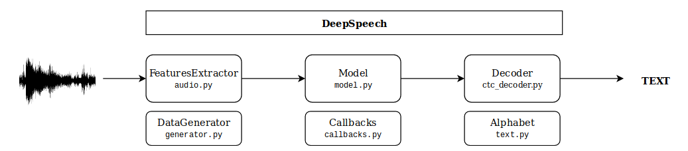

# DeepSpeech-Keras 
The DeepSpeech-Keras project helps to do the Speech-To-Text analysis easily. 

```python
from deepspeech import load

deepspeech = load('pl')
files = ['path/to/audio.wav']
sentences = deepspeech(files)
```

**Using DeepSpeech-Keras you can**:
- perform speech-to-text analysis using pre-trained models
- tune pre-trained models to your needs
- create new models on your own

All of this was done using [Keras API](https://github.com/keras-team/keras) and Python 3.6. 
The main principle behind the project is that program and it's structure should be easy to use and understand.

**DeepSpeech-Keras key features**:
- **Multi GPU support**: we do data parallelism via [`multi_gpu_model`](https://keras.io/utils/#multi_gpu_model).  This induces 
quasi-linear speedup on up to 8 GPUs. 
- **CuDNN support**: Model using [CuDNNLSTM](https://keras.io/layers/recurrent/) implementation by NVIDIA Developers. CPU devices is also supported.
- **DataGenerator**: The feature extraction (on CPU) can be parallel to model training (on GPU). Moreover it can 
use precomputed features saved in a hdf5 file. 
echo ". /home/rolczynski/.anaconda3/etc/profile.d/conda.sh" >> ~/.bashrc

## Installation
You can use pip (not prepared yet):
```bash
pip install deepspeech-keras
```
Otherwise clone the code and create a new environment via conda:
```bash
git clone https://github.com/rolczynski/DeepSpeech-Keras.git
conda env create -f=environment.yml     # or use: environment-gpu.yml
conda activate DeepSpeech-Keras
```

## Getting started
The speech recognition is a tough task. You don't need to know all details to use one of the pretrained models.
However it's worth to understand conceptional crucial components:
- **Input**: WAVE files with mono 16-bit 16 kHz (up to 5 seconds)
- **FeaturesExtractor**: Convert audio files using MFCC Features
- **Model**: CTC model defined in [**Keras**](https://keras.io/) (references: [[1]](https://arxiv.org/abs/1412.5567), [[2]](https://arxiv.org/abs/1512.02595))
- **Decoder**: Beam search algorithm with the language model support decode a sequence of probabilities using _Alphabet_
- **DataGenerator**: Stream data to the model via generator
- **Callbacks**: Set of functions monitoring the training



Loaded pre-trained model has already all components. The prediction can be invoked implicit via `__call__` 
method or more explicit:

```python
from deepspeech import load

deepspeech = load('pl')             # Also can be: load(dir='model_dir')
files = ['to/test/sample.wav']

X = deepspeech.get_features(files)
y_hat = deepspeech.predict(X)
sentences = deepspeech.decode(y_hat)
```

### Tune pre-trained model
The heart of the  _deepspeech_  is the **Keras model** (`deepspeech.model`). You can make use of all
available Keras [methods](https://keras.io/models/model/#methods) like _predict_on_batch_, 
_get_weights_ ect. You can use it straightforward.

However rather than write your own training routine from scratch, you can use the _deepspeech.fit_ method. 
Algorithm attributes (_generators_, _optimizer_, _ctc loss_, _callbacks_ ect) are already set and 
they are ready to use. All you have to do is to create new or modify `configuration.yaml` file.

```python
from deepspeech import DeepSpeech

deepspeech = DeepSpeech.construct('/tuned-model/configuration.yaml',
                                  '/tuned-model/alphabet.txt')
deepspeech.load('pl')       # Raise error if different architecture is defined

train_generator = deepspeech.create_generator('train.csv', batch_size=32)
dev_generator = deepspeech.create_generator('dev.csv', batch_size=32)

deepspeech.fit(train_generator, dev_generator, epochs=5)
deepspeech.save('/tuned-model/weights.hdf5')
```

### Creating new models
If you have several GPU's and more than 500 hours labeled audio samples, you could start to create new models. 
You can use [run.py](https://raw.githubusercontent.com/rolczynski/DeepSpeech-Keras/master/run.py) 
script as a guideline. In configuration file you specify parameters for all five components:

```yaml
features_extractor:       # audio.py: FeatureExtractor parameters (e.g. win_len or win_step)
model:                    # model.py: Model parameters (e.g. units)
optimizer:                # deepspeech.optimizer: Optimizer parameters (e.g. name or lr)
callbacks:                # callback.py: List of callback parameters (e.g tensorboard)
decoder:                  # ctc_decoder.py: Decoder parameters (e.g. naive)
```

For more details check default [configuration](https://raw.githubusercontent.com/rolczynski/DeepSpeech-Keras/master/models/pl/configuration.yaml) 
for polish. Of course you don't have to use the configuration file. You can define all required dependencies 
(decoder, model ect) and pass to the deepspeech _init_. Moreover each component can be replaced and you can pass your own objects.


### Useful scripts
In [scripts]() folder you can find e.g.:
- `confusion_matrix.py`: Investigate what mistakes were made and plot results.
- `consumer.py`: Manage between different experiments. Create a queue file and in each line write command line to execute.
- `features.py`: Extract features and save them in the hdf5 file ready to use by DataGenerator.
- `evaluate.py`: Script to do a model evaluation. Calculate WER, CER and different statistics.

## Pre-trained models
The calculations are in progress.


## Related work
Amazing work was already done. Check out the implementations of
[Mozilla DeepSpeech](https://github.com/mozilla/DeepSpeech) (TensorFlow), 
[deepspeech.pytorch](https://github.com/SeanNaren/deepspeech.pytorch) (PyTorch) or 
even [KerasDeepSpeech](https://github.com/robmsmt/KerasDeepSpeech) (Keras).  This project is 
complementary to projects listed above. It tries to be more user-friendly for the newcomer users. 


## Contributing
Have a question? Like the tool? Don't like it? Open an issue and let's talk 
about it! Pull requests are appreciated! Interesting fields to improve:
- support for different languages (or e.g. import weights from DeepSpeech pre-trained model)
- rewrite `keras` model into `tensorflow.keras`
- implement [Eager Execution](https://www.tensorflow.org/guide/eager) to make a debugging more interactive
- Seq2Seq model training with language model (+attention)

<br>

#### The computational resource is available thanks to:

